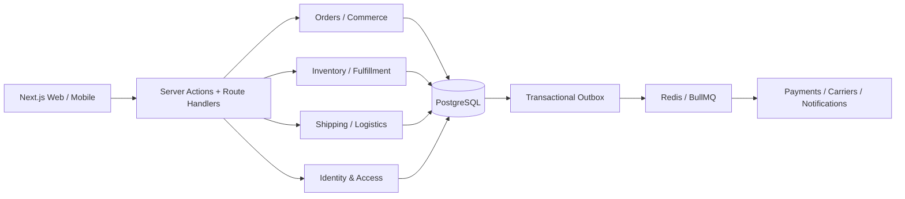

# Arquitectura de referencia

## Decisión principal

Se adopta un **monolito modular distribuible**, organizado por dominios y vertical slices. Es más seguro para consistencia transaccional y velocidad inicial que microservicios prematuros. Los límites, eventos y puertos permiten extraer servicios cuando volumen, equipos o aislamiento lo justifiquen.

## Capas por módulo

Cada `modules/<bounded-context>` contiene:

- `domain`: agregados, value objects, reglas y eventos; sin dependencias de framework.
- `application`: casos de uso verticales, puertos y DTOs.
- `infrastructure`: Prisma, Redis, proveedores y adaptadores.
- `presentation`: Server Actions, Route Handlers y componentes.

Las importaciones solo apuntan hacia adentro. Ningún módulo lee tablas privadas de otro: usa un puerto de aplicación, una proyección o un evento versionado.

## Multi-tenancy

Modelo inicial: base y esquema compartidos con `tenantId` obligatorio e índices compuestos. La defensa es por capas:

1. Tenant resuelto desde sesión, OAuth client o API key.
2. Repositorios exigen `TenantContext`; no aceptan tenant proporcionado por DTO.
3. Restricciones e índices incluyen `tenantId`.
4. PostgreSQL Row Level Security se habilita en migración endurecida antes de producción.
5. Jobs y eventos transportan tenant y correlation IDs firmados.
6. Pruebas de aislamiento intentan acceso cruzado explícitamente.

Clientes regulados podrán migrarse a schema o base dedicada mediante el mismo puerto de persistencia.

## Consistencia y escala

- Transacciones locales para invariantes de cada agregado.
- Transactional outbox para efectos externos; consumidores idempotentes.
- Optimistic concurrency (`version`) en saldos de inventario.
- Redis solo para caché, rate limiting, locks acotados y colas; PostgreSQL es la fuente de verdad.
- Webhooks se autentican, persisten primero y se procesan asíncronamente.
- Lecturas analíticas evolucionan a réplicas/proyecciones; nunca cargan el OLTP sin límites.

## Adaptadores de transportadoras

Contrato futuro `CarrierAdapter`: `quote`, `createShipment`, `cancelShipment`, `track`, `schedulePickup`, `normalizeWebhook`. Cada adaptador declara capacidades, países, credenciales versionadas y mapeo de estados al vocabulario canónico. La lógica OMS/TMS no conoce SDKs de transportadoras.

## Seguridad

- RBAC por permisos (`orders:read`, `inventory:adjust`) y scopes de recurso.
- 2FA, sesiones rotativas y reautenticación para acciones sensibles.
- Secretos fuera del repositorio; cifrado de credenciales de integraciones mediante KMS/envelope encryption.
- CSP, CSRF para flujos basados en cookies, límites por identidad/tenant/IP y validación Zod.
- Auditoría append-only, retención configurable, backups cifrados y restauraciones ensayadas.

