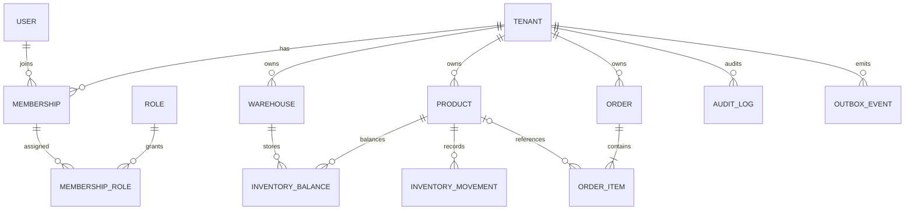

# Modelo de datos inicial

Los JSON actuales (`customer`, direcciones y settings) son snapshots deliberados. Se normalizarán en CRM y Locations cuando esos bounded contexts entren en alcance. No deben usarse como sustituto permanente de entidades con invariantes.

